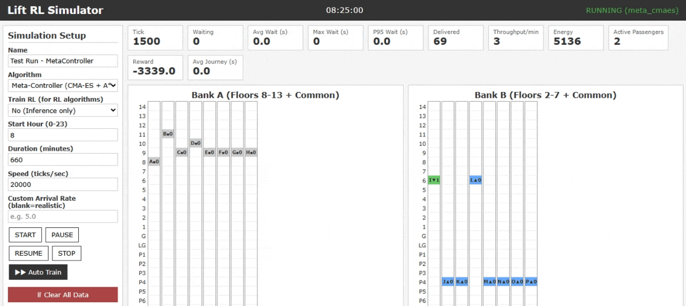
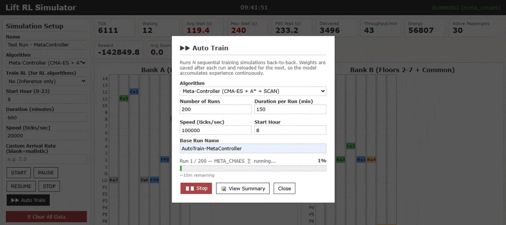

# Multi-Agent Reinforcement Learning (MARL) for Elevator Dispatching

## Abstract

Elevator dispatching is a highly complex Multi-Agent Pathfinding (MAPF) problem. The system must balance competing objectives: minimizing passenger Hallway Wait Time, minimizing In-Car Journey Time, and reducing mechanical Energy Consumption.

This repository contains a custom-built, physics-accurate elevator simulation environment and compares traditional heuristic algorithms (SCAN, A*, Nearest First) against Reinforcement Learning policies (PPO, CMA-ES, DQN) trained to optimize a multi-objective reward function across variable daily traffic profiles.

---

## The Environment & Physics Engine

Unlike highly abstracted grid-worlds, this environment models real-world elevator physics and passenger behaviors:

* **Kinematics:** 1-tick travel times, realistic acceleration/deceleration penalties, and door open/close timers.
* **Directional Boarding:** Passengers refuse to board lifts traveling in the opposite direction of their destination, preventing infinite door-stuttering loops.
* **Variable Traffic Profiles:** Includes morning Up-Peaks, Lunchtime chaos, and evening Down-Peaks to test algorithmic generalization over a full 11-hour day.
* **Safety & Crowd Guardrails:** Hardcoded safety filters prevent elevators from overshooting the roof/basement, and stairway-desertion mechanics trigger if hallway queues exceed 20 passengers.

---

## Algorithms Implemented

### Traditional Heuristics (Baselines)

* **SCAN (The Conveyor Belt):** Highly effective at minimizing hallway wait times (~5s) but heavily penalizes Journey Time and consumes massive amounts of energy by constantly moving empty cars.
* **A* Dispatch:** Calculates exact physical distances and urgency but struggles with "Logarithmic Starvation" during peak hours.
* **A* + Scan Hybrid:** Merges the intelligence of A* with the directional memory of SCAN to prevent multi-agent dogpile thrashing.

### Reinforcement Learning (MARL)

* **CMA-ES (Covariance Matrix Adaptation):** Bypasses the multi-agent credit assignment problem by evolving weights based on full-episode trajectory fitness. Successfully learned to balance Wait Time and Energy.
* **PPO (Proximal Policy Optimization):** Evaluated for step-by-step policy gradient learning.
* **DQN / QR-DQN:** Explored for discrete action-value mapping.

---

## Key Findings & Reward Shaping

### The Wait Time vs. Journey Time Loophole

Initial training revealed that RL models and the SCAN baseline would "cheat" by stopping at every floor. This instantly reduced "Wait Time" to near zero but trapped passengers inside the car for several minutes.

**Solution:** The reward function was reshaped to penalize both Hallway Wait Time and In-Car Journey Time using a logarithmic scale with a starvation guardrail:

```
Reward = (Deliveries) - (Energy) - ln(1 + Wait/10) - ln(1 + Journey/10) - Starvation_Penalty
```

The starvation penalty applies a linear bleed whenever any passenger has waited more than 5 minutes, forcing the agent to service neglected floors rather than optimizing the average.

### The Pareto Frontier (Energy vs. Efficiency)

By shifting the weights of the multi-objective reward function, the CMA-ES agent successfully learned specialized policies, demonstrating a clear Pareto frontier:

* **The Eco-Policy:** Minimizes mechanical movement, saving approximately 35% energy at the cost of slightly higher peak wait times.
* **The Balanced Policy:** Achieves an optimal middle ground (e.g., 14 seconds wait time, 21 seconds journey time) outperforming both pure A* and pure SCAN over an 11-hour simulation.

---

## Installation & Usage

### Prerequisites

* Python 3.8 or higher
* PyTorch 2.0+
* Flask 3.0+

### Local Setup

1. Clone the repository:

```bash
git clone https://github.com/BabutaAniket/Elevator_MARL
cd lift-rl-simulator
```

2. Create and activate a virtual environment:

```bash
python -m venv env
source env/Scripts/activate  # On Windows: env\Scripts\activate.bat
```

3. Install dependencies:

```bash
pip install -r requirements.txt
```

4. Run the Flask server:

```bash
python app.py
```

5. Open your browser and navigate to `http://localhost:5000`.

---

## Visualization & Demo

### Live Simulation
Watch the elevator system in action with real-time floor visualization, passenger queues, and performance metrics:



*Real-time elevator dispatching with floor-by-floor visualization. Shows lift positions, passenger loads, hallway queues, and live KPI metrics (wait times, delivery throughput, energy consumption).*

### Auto-Training Mode
Automated training loop that runs sequential simulations and iteratively improves the policy:



*Batch training interface showing sequential runs with automatic weight updates. The system trains multiple episodes back-to-back and reloads weights for continuous improvement, enabling efficient policy evolution.*

---

## Running an Auto-Train Session

To train a model from scratch using the web UI:

1. Select your algorithm from the dropdown (e.g., CMA-ES, PPO, DQN).
2. Set the duration in minutes (e.g., 150 for burst training across variable traffic profiles).
3. Optionally configure the starting hour to test specific traffic patterns (morning, lunch, evening).
4. Click the "Auto-Train" button to begin the evolutionary loop.
5. The SQLite database will automatically log trajectory statistics for each episode.
6. View detailed PDF reports for each run, including KPI metrics and reward curves.

---

## Database & Reporting

All simulation runs are persisted to SQLite with the following tracked metrics:

* Total passengers delivered
* Mean average wait time and peak wait times
* Average journey time (boarding to alighting)
* Total energy consumption
* Cumulative reward across the episode
* Per-tick statistics sampled at configurable intervals

The web UI generates interactive charts and downloadable PDF reports for post-hoc analysis and model comparison.

---

## Architecture

The codebase is organized as follows:

* `environment.py` - Core physics engine, reward computation, and state representation
* `simulation.py` - Training loop coordinator, agent lifecycle management, and episode orchestration
* `agents.py` - Heuristic baseline implementations and RL policy wrappers
* `database.py` - SQLite schema and data persistence layer
* `app.py` - Flask server and REST API endpoints
* `config.py` - Global configuration constants
* `templates/` - HTML/JavaScript frontend for the web UI
* `models/` - Saved weights for trained policies

---

## Future Work

* **Vectorized Environments:** Implementing SubprocVecEnv via Python Multiprocessing to break the GIL bottleneck and scale training speeds by an order of magnitude.

* **Curriculum Learning:** Gradually increasing the building's population density over generations to drive more robust policies.

* **Multi-Objective Optimization:** Exploring Pareto frontier navigation and weight-space interpolation for policy specialization.

* **Real-World Validation:** Bridging simulation to real elevator systems through field testing and sim2real transfer.


## Contributors

For questions, bug reports, or collaboration inquiries, please open an issue or contact the maintainers.

Aniket Babuta  
Email: aniketbabuta@gmail.com
